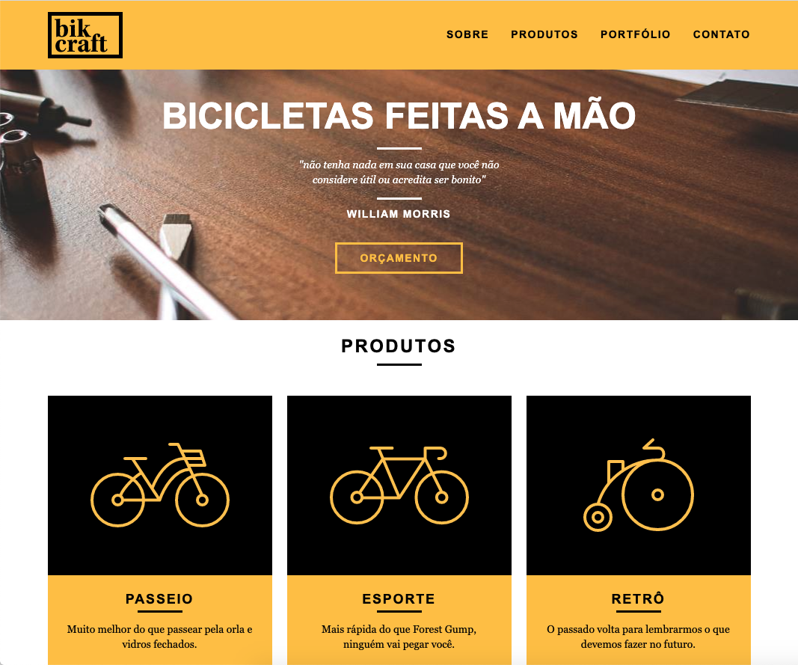
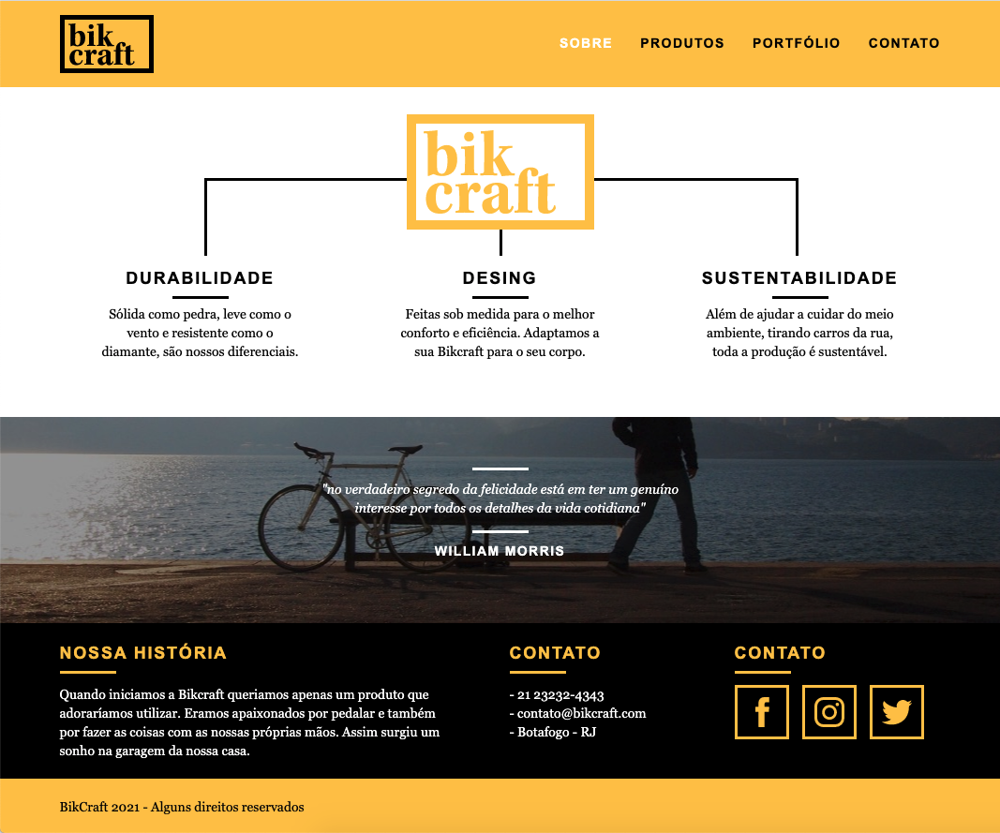
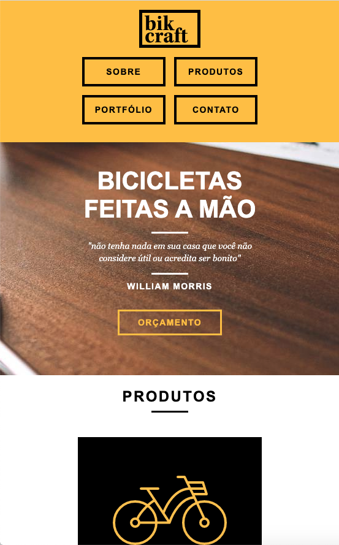
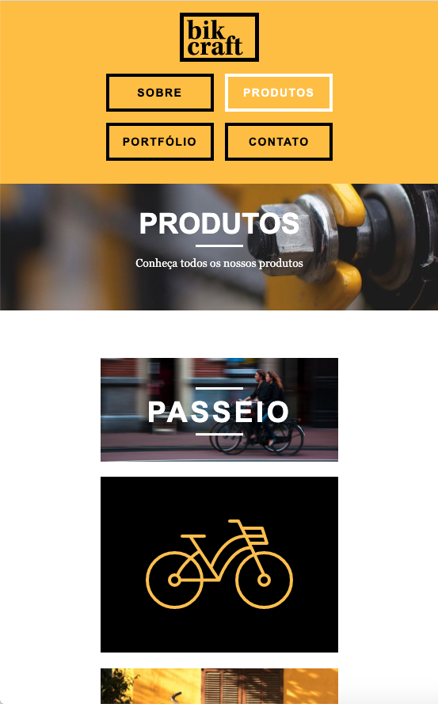
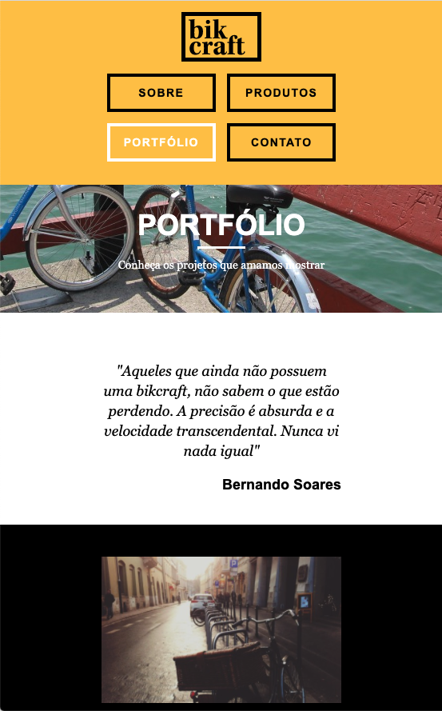
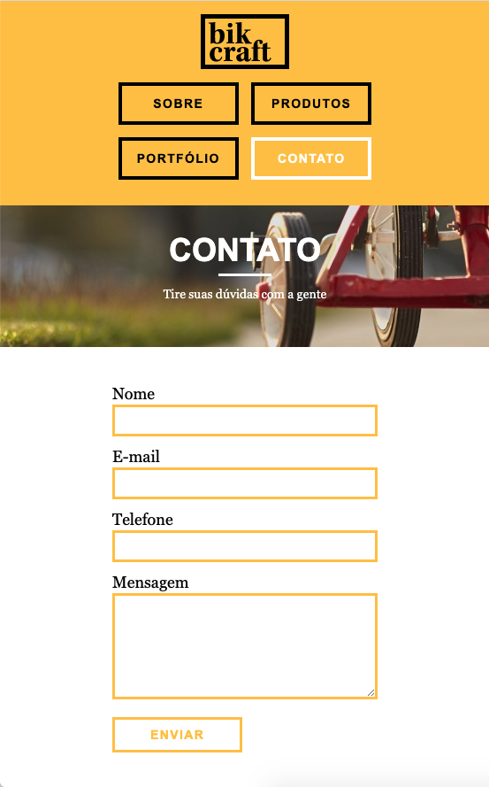

<h1 align="center">
    
</h1> 

# Projeto bikcraft
Projeto desenvolvido no curso de Web Design da plataforma [Origamid](https://www.origamid.com/).

### 
 [Sobre](#sobre) | [Layout](#layout) | [Tecnologias Utilizadas](#tecnologias-utilizadas) 

  

## Sobre 

Esse projeto foi desenvolvido durante o curso de Web Design Completo, da plataforma Origamid.

Durante o curso, realizamos todo o projeto do site institucional de uma empresa ficticia, a **bikcraft**, que vende bicicletas personalizadas e feitas sob medida. 

Começando os estudos criando o briefing do cliente, estruturamos a arquitetura do site, montamos os wireframes e logo em seguida os layouts pelo Figma, utilizando os principais conceitos de **UI/UX Design**. Logo após, iniciamos a **codificação** do site, utilizando **HTML5** focando nas boas práticas de semântica, **CSS3** e **JavaScript**. 

O site também foi criado de maneira totalmente responsiva e otimizado para SEO.

#### Acesse o site completo: <a href="https://vaniamesquita.me/bikcraft/" target="_blank">vaniamesquita.me/bikcraft</a> 

---

## Layout

Você pode acessar o projeto clicando <a href="https://vaniamesquita.me/bikcraft/" target="_blank">aqui</a>

#### 
Web

<table align="center">
   <tr>
    <td valign="top"> </td>
    <td valign="top"> </td>
   </tr>
 </table>
  

#### 
Mobile
 

<table align="center">
   <tr>
    <td valign="top"> </td>
    <td valign="top"> </td>
    <td valign="top"> </td>
    <td valign="top"> </td>
  </tr>
 </table>
  
 
 ---

## Tecnologias utilizadas

- **HTML5**
- **CSS3**
- **JavaScript** (com os plugins [SimpleSlide](https://github.com/origamid/simple-slide), [SimpleAnime](https://github.com/origamid/simple-anime) e [SimpleForm](https://github.com/origamid/simple-form))
- **Figma**

---

## 👩🏻‍💻 Autora

<a href="https://github.com/vaniamesquita"> 
  
 Feito com :blue_heart: por <b>Vania Mesquita</b></a>  

 

 

